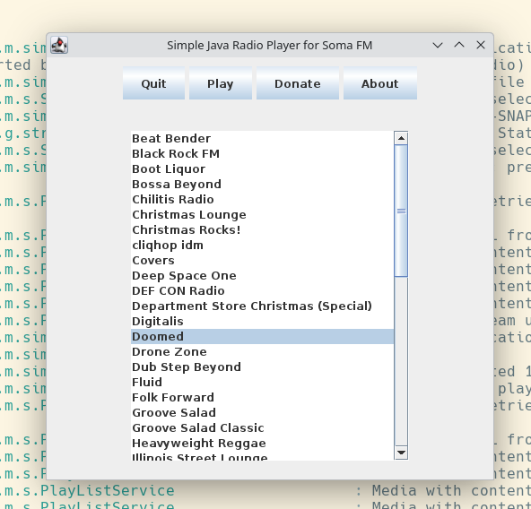

# Simple Java Radio Player for Soma FM

This software is not associated with Soma FM.
It's a hobby project. It's for me hearing Soma FM where ever I be.

- Plays Soma FM stations
- Soma Station list configured
- Inspired from Soma Radio from Alex Kryuchkov
- Based on goxr3plus Java stream player
- Resilient against broken streams

## Build & Run locally

### Maven

mvn clean package

java -jar target/simple-java-radio-player.jar

### Flatpack

flatpak-builder --force-clean --user --install-deps-from=flathub --repo=repo --install builddir
com.mirkoebert.simple-java-radio-player.yml

flatpak run com.mirkoebert.simple-java-radio-player

Check flatpack build manifest   
flatpak run --command=flatpak-builder-lint org.flatpak.Builder appstream simple-java-radio-player.metainfo.xml

